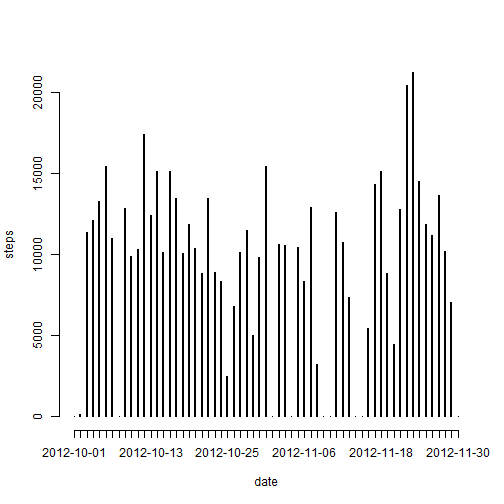
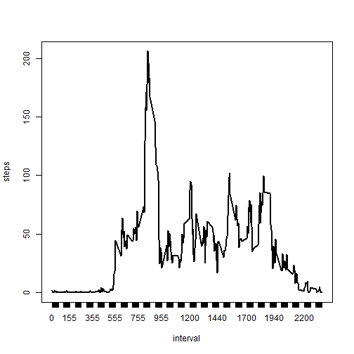
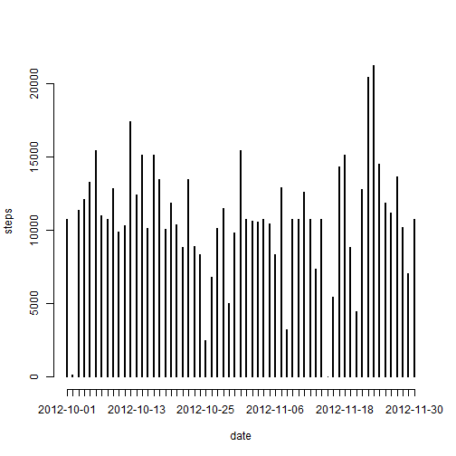

Reproducible Research: Peer Assessment 1
=========================================================
YANHUANG LU


```r
opts_chunk$set(echo = TRUE)
```

## Loading and preprocessing the data

```r
setwd("C:/Users/Johnny/R/RepData_PeerAssessment1")
data <- read.csv("activity.csv", header = TRUE)
```


## What is mean total number of steps taken per day?

```r
plot(xtabs(steps ~ date,data=data),type="h",ylab="steps")
```

 

```r
mean_step <- mean(xtabs(steps~date,data=data),na.rm = TRUE)
median_step <- median(xtabs(steps~date,data=data),na.rm = TRUE)
```
Mean of total number of steps taken per day is 9354.2295082.
Median of total number of steps taken per day is 1.0395 &times; 10<sup>4</sup>.

## What is the average daily activity pattern?

```r
xt <- xtabs(steps ~ interval,data=data)
plot(xtabs(steps ~ interval,aggregate(steps ~ interval, data, mean)),type="l",ylab="steps")
```

 

```r
max_steps_p <- which.max(xt)
max_steps <- attributes(xt)$dimnames$interval[max_steps_p]
```
The 5-minute interval, on average across all the days in the dataset, contains the maximum number of steps, is interval 835.


## Imputing missing values

```r
miss <- sum(as.integer(is.na(data$steps)))
```
Total number of missing values in the dataset is 2304.

Since there are missing values in the data set, using the mean for that 5-minute interval to fill the missing values.


```r
data2 <- data
for (i in 1: length(data2$date)){
        if(is.na(data2$steps[i])){
                interval <- data2$interval[i]
                data2$steps[i] = mean(data2[data2$interval == interval, "steps"], na.rm = TRUE)
        }
}
```
Histogram of the total number of steps taken each day is now as below.

```r
plot(xtabs(steps ~ date,data=data2),type="h",ylab="steps")
```

 

```r
mean_step2 <- mean(xtabs(steps~date,data=data2),na.rm = TRUE)
median_step2 <- median(xtabs(steps~date,data=data2),na.rm = TRUE)
```
Mean of total number of steps taken per day is 1.0766189 &times; 10<sup>4</sup>.
Median of total number of steps taken per day is 1.0766189 &times; 10<sup>4</sup>.

## Are there differences in activity patterns between weekdays and weekends?

```r
library(timeDate)
d <- isWeekday(as.Date(data$date))
data2$weekday<-ifelse(d==TRUE,"weekday","weekend")
library(ggplot2)
qplot(interval,steps,data=data2,facets=weekday ~.,stat="summary",fun.y="mean",geom="line")
```

 
